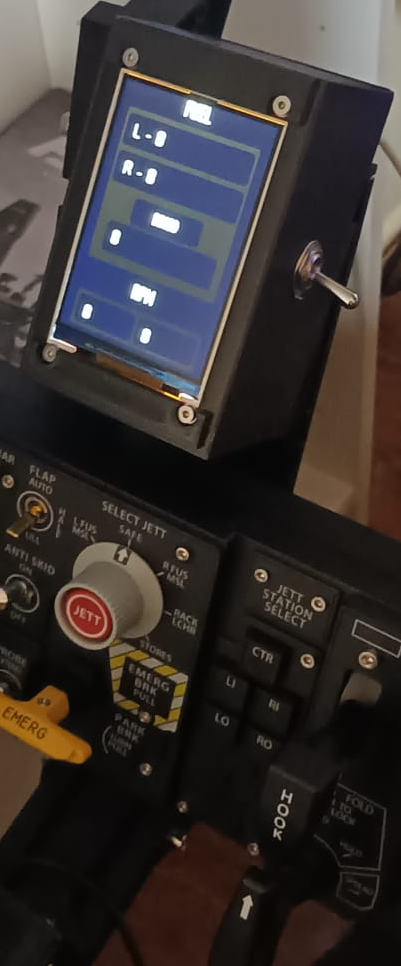

# Tools
## AOE Indexer + Fuel Information
### First, install the necessary libraries:
* install the zip library of dcs_bios to arduino, https://github.com/DCS-Skunkworks/dcs-bios , in this github in the Programs folder you can get the zip needed to install the library.
* install the **TFT_eSPI** library, it can be found in the library searcher inside arduino ide.

### Second, Sensors:
* **SP8266** , this programas are based on that chip, its possible to do with ESP32 and arduino uno, nano..., but i leave it to you :).
 [SP8266 Aliexpress](https://es.aliexpress.com/w/wholesale-ESP8266.html?spm=a2g0o.cart.search.0)
*  **Screen ILI9488** , if you want to use another type like ILI9431....., you only have to go to the **tft_espi** inside **arduino libraries folder**, and in the user_setup.h change the driver to the one you need.
  [Screen ILI9488 Aliexpress](https://es.aliexpress.com/item/1005005791515997.html?spm=a2g0o.order_list.order_list_main.56.4f3c194dc6ImMH&gatewayAdapt=glo2esp)
* **Lever switch**, i use this lever to Master Arm Switch, ARM/SAFE.
  [Lever switch Aliexpress]( https://es.aliexpress.com/item/4000598302546.html?spm=a2g0o.order_list.order_list_main.188.4c37194dBEiiyU&gatewayAdapt=glo2esp)

#### if you use the esp8266 finally, I recommend to replace `custom_serial.cmd` from `dcs-bios` and use the custom one from `system_scripts` folder, and copy `restart_esp8266.ps1` script into the same folder. It will restart the` esp8266 RTS circuit` each time you init the dcs bios connect serial, if you dont want to use it, you probably are going to need to upload the arduino sketch each time you want to use the module in dcs, because if not, your module will not work.
  
### to know how to connect the sensors to the ESP8266, i recommend this resources:
* https://www.youtube.com/watch?v=9wrHhbfYFXg
* http://www.nihamkin.com/better-tft-library-for-esp8266.html

### 3d files
the 3d files are simple, its only one screen protector with an space for the lever switch.

### testing inside DCS
When you had all you sensors working and everything configured, i recommend this video [How to connect with dcs](https://www.youtube.com/watch?v=ZGoG54vNyyI&t=717s)

### functionality done
Right now the program only change between aoe_indexer and engine_information, if the landing gear is down, aoe_indexer will be active, otherwise, the engine information. 

